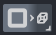
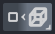
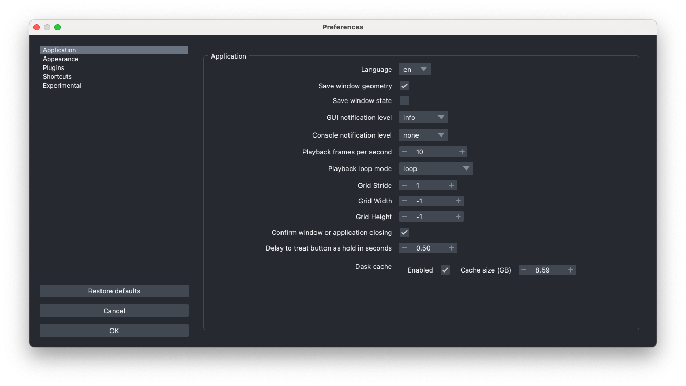

# napari application

```{note} This content was based on [material from a workshop](https://github.com/dgmccart/intro-to-napari-workshop) prepared by Dannielle McCarthy (@dgmccart), Sean Martin (@seankmartin), and Melissa Weber Mendonça (@melissawm).
```
For full documentation of the napari viewer, please see [the Viewer tutorial](https://napari.org/stable/tutorials/fundamentals/viewer.html) in the napari docs. Here we will just have an overview.

## Launch napari

For this introduction, we will launch the napari application directly from the terminal. Note: If you are using the napari bundle app, you can just double-click the napari icon to launch it like a normal application.

````{important}
Remember to activate the right environment!

```bash
conda activate intro-napari-workshop
```
````

Once you have the proper environment active, you can launch napari by typing `napari`:

```bash
napari
```

After a few seconds (or up to a minute if it's the first launch and you have various security and antivirus software installed), you will get the `viewer` window, which is annotated below:

  


## Open an Image
  
You can open one of your own images with:  
* **File** > **Open files** and select a tif, png, or jpg file
* drag-n-drop one onto the canvas
* **File** > **New Image from Clipboard** to paste an image from the clipboard or open an image from a URL you have copied.

```{note} By default, napari can open (and save) a wide range of non-proprietary file formats handled by [imageio](https://imageio.readthedocs.io/en/stable/formats/index.html) and [tifffile](https://pypi.org/project/tifffile/), as well as `zarr` and `numpy` arrays. For proprietary image formats or more advanced reader features (metadata or multiscale handling) you will need to install an appropriate plugin for the file. You can search the [napari-hub](https://napari-hub.org) to find one!
```

* Open a sample image that comes with napari by selecting:  
**File** > **Open Sample** > **napari builtins** > **Cells (3D + 2Ch)**  

Images are opened as layers in the viewer and will be available in the "Layer List" on the left, middle side of the viewer. Typically, multi-channel images will be opened as multiple layers. The order of the layers in the list will determine how they are displayed on the canvas. The top layer in the list, the last one added, is rendered as on top of the others. You can change the order of the layers by dragging them up and down in the list.  

```{tip}
In napari the `Close` command will close the viewer. If you no longer wish to view a image, you can delete the layers associated with the image, by selecting them individually using the trash can icon or by pressing the backspace/delete key. To delete all layers in the layer list,  select any single layer, and then press Command+A (Mac) / Control+A (Windows and Linux) to select all layers. Then click the trash can button on the top right of the layer list. 
```


## Explore Images in 2D and 3D  

* Toggle layer visibility on and off with the **eye button to the left of the layer name** in the layer list. You can also Alt/Option-click on the eye icon of a layer of interest to toggle hiding/showing all *other* layers. 

* Scroll (use two finger scroll on a touchpad) to zoom in and out.  

* Click and drag to move the images in the canvas.  

* Use the dimension sliders beneath the canvas to  control the z position/slice number. Slide through the 3D stack one 2D slice at a time. You can jump to a specific slice by double clicking on the slice number on the far right side, entering a new number and pressing enter to confirm.  

```{tip}
You can re-name the slider axis by double clicking on the label (typically a number) on the left side of the slider. Enter a new label and press enter to confirm.
```

* To change the order of the displayed axes (e.g. to get an orthogonal view), you can use the dimensions sorter button:

Right-click on it to drag and drop the axes in a different order or to rename the viewer axes labels.

* Press the `home` button to bring the image back to the center of the canvas.  
  
It is on the right end of the row of viewer buttons.  

* Explore images in 3D by toggling the `2D/3D` button.  When you're in 2D mode, it looks like this:  
  
When you're in 3D mode, it looks like this:  

It is second from the left end on the row of viewer buttons.

```{tip}
If you see a button with a tick mark in the lower right corner, like the `2D/3D` button above, it means that you can right click on the button to reveal a menu of additional options!
```

* Click and drag on the 3D image to rotate.
* Shift + click and drag to translate (move) the 3D image.  
* Scroll to zoom in and out of the 3D volume.
* Move the _nuclei_ and _membrane_ layers to be side-by-side by toggling the `grid mode` button; it's the second button from the right end on the row of viewer buttons and acts as a toggle. 
  
 
## Adjust Image Visualization

* Select an Image layer from the layers list (selected layers are highlighted in blue in the layer list).  
* Adjust the contrast limits by using the contrast limits slider in the layer controls section.

    ```{tip} You can Control+click (Mac) or right-click (Windows and Linux) on the slider to open the expanded view with min and max pixel values labeled on the ends of the slider.
    ```  
* Adjust opacity, color map, and blending modes in the layer controls section.  
* With the viewer in 3D mode, you can also change the depiction of the image from a volume rendering to a plane rendering or adjust the rendering method. 

```{tip}
By default, napari uses `mip` or "maximum intensity projection" to render in 3D mode. This method will show the highest intensity voxels, regardless of their position relative to the camera. However, you can also use `attenuated_mip` or "attenuated maximum intensity projection" to render the image. This method will prioritize voxels closer to the camera, giving a better sense of the ordering of the visualized objects. It will also typically improve rendering performance, particularly for large volumes!
```

## Explore Stack Manipulation

* Select both the nuclei and membrane layers in the layer list using shift+click.
* Control+click (Mac)/right-click (Windows and Linux) either of the selected layers to open the layer actions contextual menu. 

    ```{note}
    The layer actions menu is contextually aware, so it will have different options enabled depending on the
    layer(s) that is selected.
    ```

    * Merge layers:	
        * With both layers selected, click **Merge to Stack** to combine the **nuclei** and **membrane** layers to make a single layer with an additional slider that controls the channel axis.  
    * Rename this layer to **cells** by double clicking the layer in the layer list and replacing the text.  
    * Rename the dimension sliders at the bottom of the canvas to read **Ch** and **Z** by double clicking the **0** and **1** on the left side of the sliders and replacing the text.  
    * Explore the data using the sliders.  
    * Open the layer action menu and split the stacks with the **Split Stack** command.  

        ```{important}
        **Split Stack** divides a layer in its *first listed dimension*, which would have index `0` and should be represented by the bottom-most slider. In this case, selecting the newly merged layer will separate the channels into separate layers. Meanwhile, applying **Split Stack** to one of the resulting layers will split the layer into a set of 2D layers for each of the z slices.
        ```

## Explore Layer Types  

The Points, Shapes, and Labels layers can be used for annotating you image layers and are accessible 
through the GUI buttons. Additional data layers (Surfaces, Tracks, and Vectors) are available through 
the API. For guides to using the various layer types, please see the [napari layer guides](https://napari.org/stable/howtos/layers/index.html).

* Add a Points, Shapes, or Labels layer using the buttons above the layers list.
    * These layers will be blank to begin with.  
    * In 2D mode, use the layer controls to add points, draw some shapes, or paint some labels on your image (referring to Points, Shapes, and Labels layers respectively). Annotating in 3D can be really tricky and is only supported for Points and Labels layers.


## Save your data

There are two options for saving your data: 
* saving the *data* underlying the layer
* saving the currently rendered view on the canvas 

### Saving what you see on the screen

To save the currently rendered view, use the File menu **Save Screenshot**. You can also choose to include
the viewer or to save the screenshot to the clipboard instead of a file. Screenshots are saved as `.png` files, so you can easily use them in presentations, emails, or reports.

### Saving the data of a single layer

You can save the layers individually using the File menu or Command+S (Mac) / Control+S (Windows and Linux).
* For image layers, you can select the file type by choosing the whether the output should be "lossy" or "lossless" and then providing the extension. A range of lossy (e.g. `.jpg`) and lossless (e.g. `.png` or `.tiff`) are supported by the builtin writer. Note: Some formats may not work equally well for all image types, e.g. 3D stacks may be saved as (animated) `.gif` or `.png` files, but not as `.jpg` files.
* Points and Shapes layers are saved as `.csv` files that contain their coordinates and can be read back into napari.
* Labels layers are saved as `.tiff` files.

```{tip}
Plugins can provide additional saving options for layers!
```

### Saving the data of multiple layers

Multiple different layer types, e.g. image and points, can be saved to a **single `.svg` file**,
which can be convenient for use in a vector graphics program or for web. 
* Select more than one layer and use the File menu or Command+S (Mac) / Control+S (Windows and Linux), then in the dialog dropdown menu ensure `napari SVG` is selected, give the file a name, and save.

    ```{important} 
    The output file will not be openable in napari!
    ```

Perhaps more usefully, multiple different layer types, e.g. image and points, can be saved as
individual layers (as described above) *to a folder.* 
* Select more than one layer and use the File menu or Command+S (Mac) / Control+S (Windows and Linux) or use Command+Option+S (Mac) / Control+Alt+S (Windows and Linux) to save all layers. Then in the dialog dropdown menu change `napari-svg` to `napari builtins Save to Folder`. Enter a folder name and hit save. A new folder with that name will be created and the files will be individually exported there, as noted above.

    ```{important} 
    To re-open the files, open the enclosing folder, select all the files, and drag-n-drop them on the napari canvas. At present, opening the folder directly, if it contains a mix of layer types, will not work—only images are supported in this way. Note that a folder of images will be imported as a stack.
    ```

## The Preferences/Settings

Here you can customize the behavior of napari, e.g. keybindings, as well as the look (e.g. font size, highlight thickness, theme).
* Access the Settings on Windows/Linux in the **File** menu or the Preferences in the **napari** menu on macOS

    * If you mouse-over the options of a particular setting, you should see a tooltip with a brief description of what the setting does.
    * Be sure and check the extensive, editable keyboard shortcuts for the viewer and each of the Layer types.

```{important}
If you know you will work with larger-than-memory images or remote data, we recommend you check the **Experimental** tab and enable the "Render Images Asynchronously" option. This will improve the user experience of the viewer for these cases, as the viewer will not freeze while loading data.
```
If you have multiple Python environments with napari, you can have different settings for each environment, because Preferences/Settings are stored *per Python environment*.  
```{tip}
The settings can reset back to defaults using `napari --reset` in the command line/terminal. This can solve some issues preventing napari from starting or crashing, particularly if napari has been updated in the environment.
```

