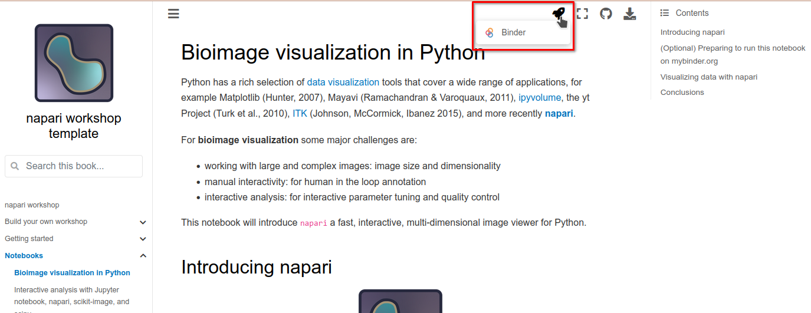
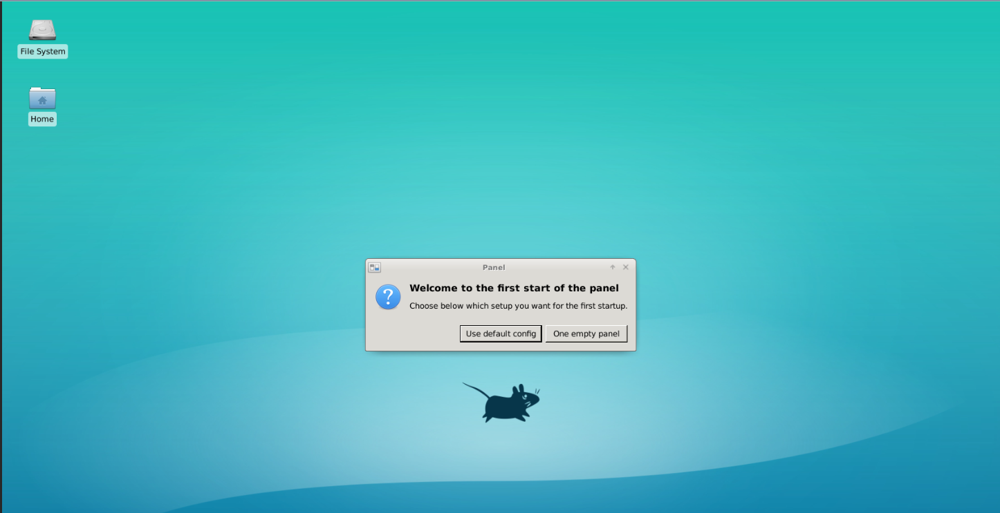
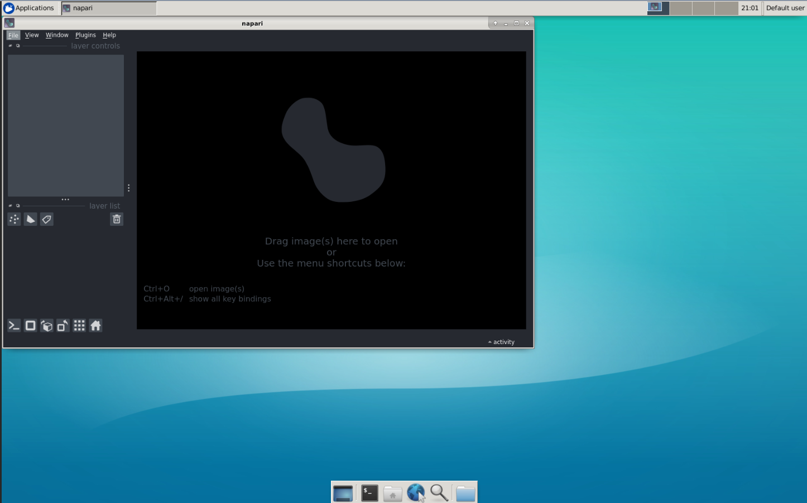

# How to open the notebooks in the cloud using [mybinder.org](https://mybinder.org)

If you can't install napari and the Jupyter notebook application locally, or if you prefer using a cloud instance of Jupyter to execute and interact with the workshop notebooks, you can follow this guide.

```{note}
Because this will launch a virtual machine in the cloud and install everything needed to run the notebook, it could take *several minutes* to spin up!
```

## Open a single notebook in Binder

To open a notebook in Binder, click on the rocketship badge at the top of a notebook and click on "Binder".



This will open the notebook in Markdown format, but it will not be runnable. Further, because napari is a desktop application, we need a "Desktop" tab to see the napari GUI interface. To do this, close the Markdown notebook and return to the Jupyter launcher.

## Open desktop tab

In the Jupyter launcher tab, click on the "Desktop" tile.


After this, you should see a new tab open up in your browser window called "Jupyter Remote Desktop Proxy", with a basic Linux desktop interface. Note if at first it doesn't connect, just close the tab and click the `D` tile a second time.



By moving your mouse pointer inside this desktop interface, you should be able to interact with it. We will use it to host the napari GUI window.

## Run notebook cells

Now that our desktop is set up, we can proceed to running each of the cells in the notebook. You can access them from the file browser on the left side, in the `notebooks` folder.

```{important}
To open these workshop notebooks in this Jupyter interface, right click the notebook name in the file navigation panel from the Jupyter interface, and click "Open with -> Notebook".


Additionally, all of these notebooks contain a code cell which needs to be run to enable the napari window to be displayed in the Binder Desktop tab. 


```

After running any cell which opens the napari viewer from the Jupyter notebook, you should now see the napari GUI window in the Desktop tab on your browser.



## Interact with the notebook!

You should now be able to interact with this notebook, by executing all cells and observing the results in the napari GUI window. You can also edit the code cells to experiment with different napari concepts and its API. You can save a snapshot of the viewer status to the notebook using the `nbscreenshot` function.
