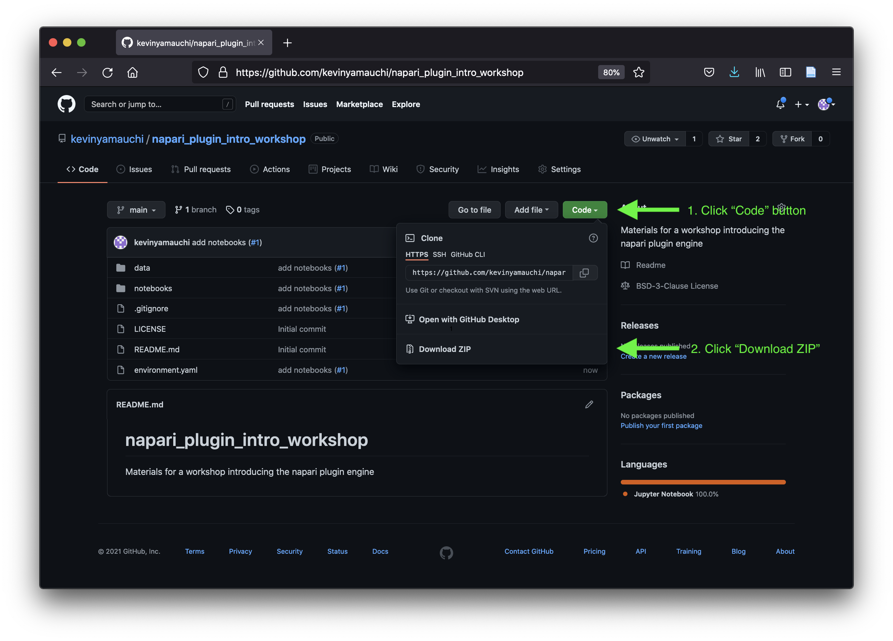
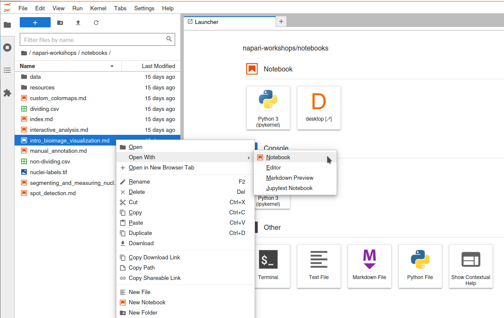

# Using Jupyter lab notebooks

During this tutorial, we will be using Jupyter notebooks to interact with napari
and do some example exploratory image analysis. We encourage you to follow along 
with your own, fresh notebook, using the executed and rendered notebooks [included in this repository](notebooks/index.md) only as a guide.

## Launch the `jupyter lab` application

1. Open your terminal application
2. Activate the `napari-workshop` conda environment if you havn't already.

  ```bash
  conda activate napari-workshop
  ```

  You should see `(napari-workshop)` to the left of your command prompt. For example it could look something like this:

  ```bash
  (napari-workshop) $
  ```

3. Launch `jupyer lab`:

  ```bash
  jupyter lab
  ```

  You should have a browser tab open with the Jupyter launcher:

  

4. Open a new notebook, by clicking the tile under `Notebooks` with the Python logo, marked in red above.

5. You can enter code into `code cells` (the default) and execute it by hitting Shift-Enter, which
  will also create a new code cell. We encourage you to follow along with the instructor and/or [the rendered web versions of the notebooks](notebooks/index.md) typing the code and interacting with the napari window. 
  
  ```{tip}
  If you want to enter rich-text notes using Markdown, press Escape, followed by the M-key, to switch to Markdown mode.
  ```

  For more detailed information on using Jupyter notebooks, see [the official Jupyter lab interface documentation](https://jupyterlab.readthedocs.io/en/stable/user/interface.html) and [the official Jupyter notebook documentation](https://jupyter-notebook.readthedocs.io/en/stable/examples/Notebook/What%20is%20the%20Jupyter%20Notebook.html)

# Downloading and launching this workshop's Jupyter notebooks

The complete, executed notebooks are hosted in the materials on this website. We encourage you
to follow along with the workshop in a fresh, blank notebook. However, if you
would like to be able to run the completed notebooks locally, you can download them
and launch the `jupyter lab` application using the instructions below.

## Downloading the notebooks

There are two ways to download the notebooks; follow the instructions below for
either downloading a .zip file (recommended for beginners) or cloning via git.

### Downloading a .zip file
To download the notebooks as a .zip file, do the following:

1. Click the GitHub logo at the top of this page or navigate your web browser to [the workshop's github repository](https://github.com/psobolewskiPhD/intro-napari-workshop): https://github.com/psobolewskiPhD/intro-napari-workshop
2. Click the green (or blue) "Code" button to open the download menu and then
   "Download ZIP" 
3. Choose the location you would like to download the .zip into.
4. Open your file browser and double click on the .zip file to uncompress it.
5. You have downloaded the notebooks! Proceed to the "Launching jupyter
   notebook" section.

### Cloning via git
To clone the repository containing the tutorial materials to your computer, open
your Terminal and navigate to the folder where you will download the course
materials into. We recommend cloning the materials into your Documents folder,
but you can choose another suitable location. 

 ```bash
 cd ~/Documents
 ```

Then, clone the repository. This will download all of the files necessary for
this tutorial.

 ```bash
 git clone https://github.com/napari/napari-workshop-template.git
 ```

## Install additional `jupytext` dependency

Because of the way the notebooks were prepared to provide a nice rendered look on the web,
you need to install one additional dependency to run them locally

````{important}
Remember to activate the right environment!

```bash
conda activate napari-workshop
```
````

```bash
conda install jupytext
```


## Launch the `jupyter lab` application

Navigate to the `notebooks` subdirectory of the
`intro-napari-workshop` directory you just downloaded.

```
cd <path to intro-napari-workshop>/notebooks
```

Remember to activate the `napari-workshop` conda environment if you havn't already.

```
conda activate napari-workshop
```

```{important}
Because of the way the notebooks were prepared to provide a nice rendered look on the web,
you need to install one additional dependency to run them locally:

```bash
conda install jupytext
```
```

To start the Jupyter application, enter:

```bash
jupyter lab
```

The Jupyter interface will open in a browser window and you will see the notebooks
in the file browser on the left.

```{important}
To open these workshop notebooks in the Jupyter interface, right click the notebook name in the file navigation panel from the Jupyter interface, and click "Open with -> Notebook".


```
