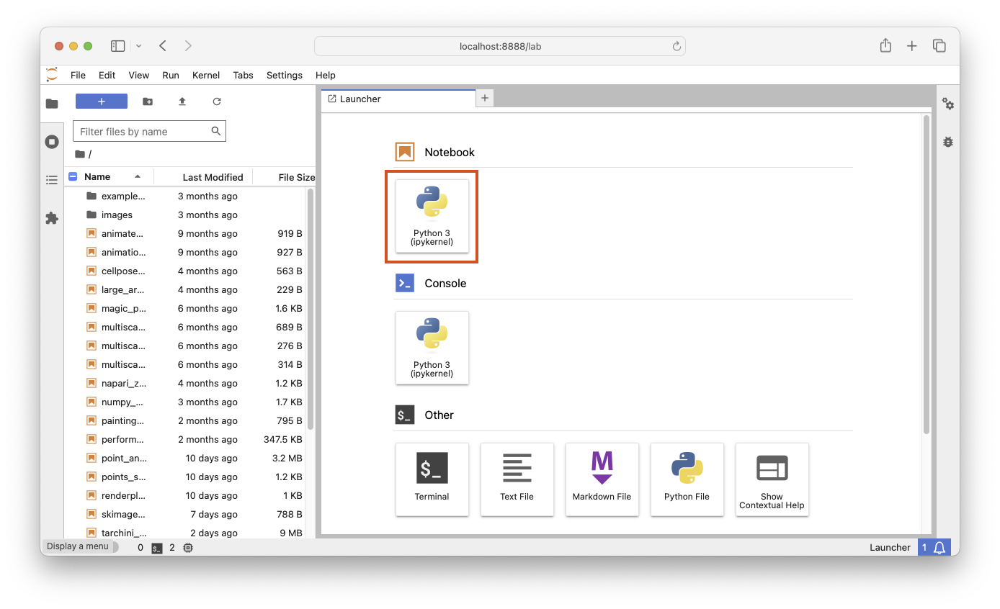

# Using Jupyter lab notebooks

During this tutorial, we will be using Jupyter notebooks to interact with napari
and do some example exploratory image analysis. We encourage you to follow along 
with your own, fresh notebook, using the executed and rendered notebooks [included in this repository](notebooks/index.md) only as a guide.

## Launch the `jupyter lab` application

1. Open your terminal application

2. Activate the `napari-workshop` conda environment, if you haven't already.

   ```bash
    conda activate napari-workshop
    ```

   You should see `(napari-workshop)` to the left of your command prompt. For example it could look something like this:

   ```bash
   (napari-workshop) $
   ```

3. Launch teh Jupyter lab web interface:

   ```bash
   jupyter lab
   ```

   You should have a browser tab open with the Jupyter launcher:

   

4. Open a new notebook, by clicking the tile under `Notebooks` with the Python logo, marked in red above.

5. You can enter code into `code cells` (the default) and execute it by hitting Shift-Enter, which
   will also create a new code cell. We encourage you to follow along with the instructor and/or [the rendered web versions of the notebooks](notebooks/index.md) typing the code and interacting with the napari window. 
  
   ```{tip}
   If you want to enter rich-text notes using Markdown, press Escape, followed by the M-key, to switch to Markdown mode.
   ```

   For more detailed information on using Jupyter notebooks, see [the official Jupyter lab interface documentation](https://jupyterlab.readthedocs.io/en/stable/user/interface.html) and [the official Jupyter notebook documentation](https://jupyter-notebook.readthedocs.io/en/stable/examples/Notebook/What%20is%20the%20Jupyter%20Notebook.html)
